# Manifest Generation using Jenkins

## Setup Jenkins Server
1. Search for Jenkins in Azure Marketplace and click `Create`. 
2. Configure the basic settings for the Jenkins server, use a secured password and an appropriate resource group, then press `OK`. 
   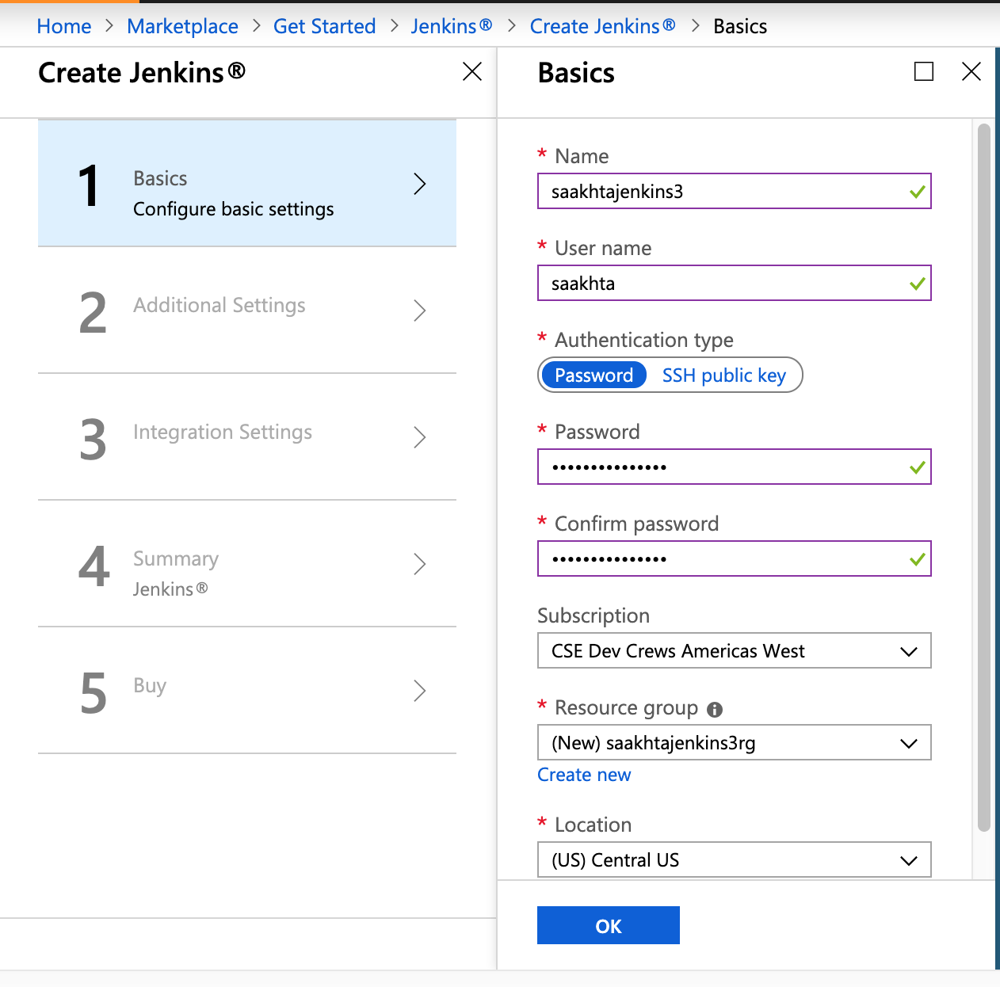
3. Configure the additional settings, use an appropriate domain name label and disk size, then press `OK`.
   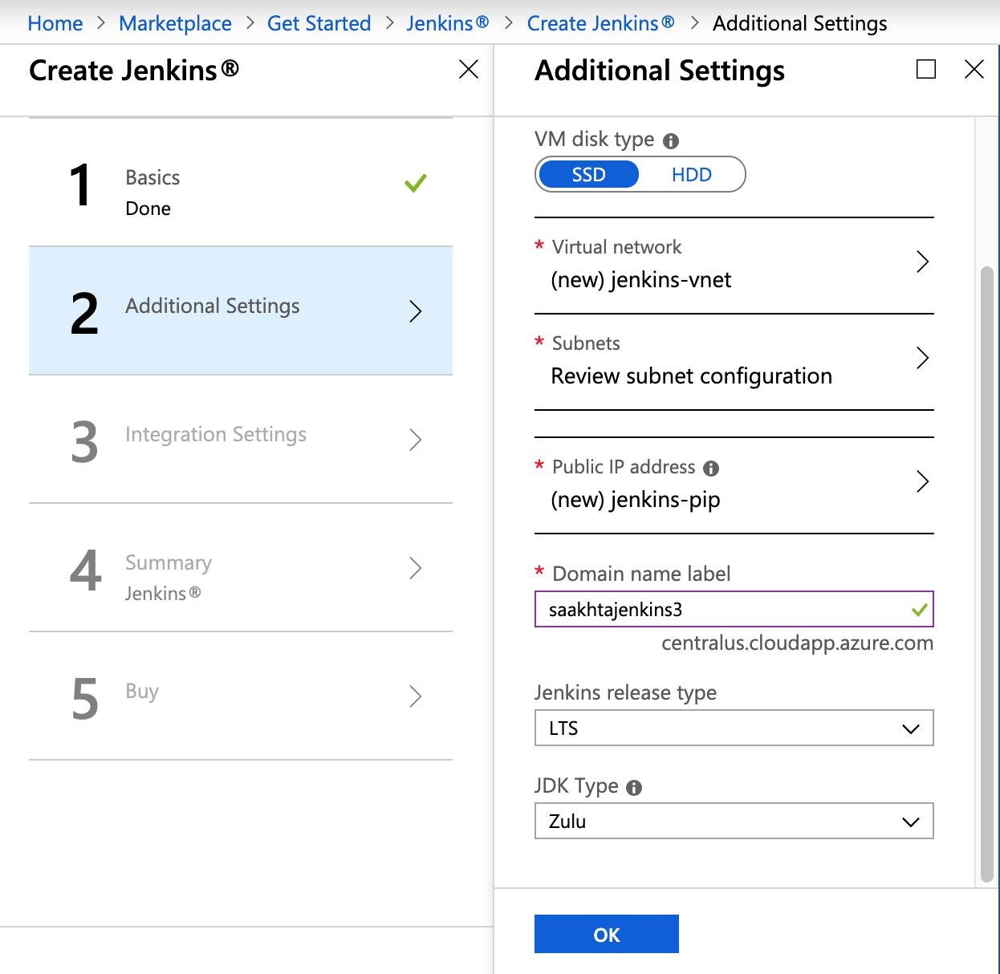
4. Select VM for `Enable cloud agents`, then press `OK`
   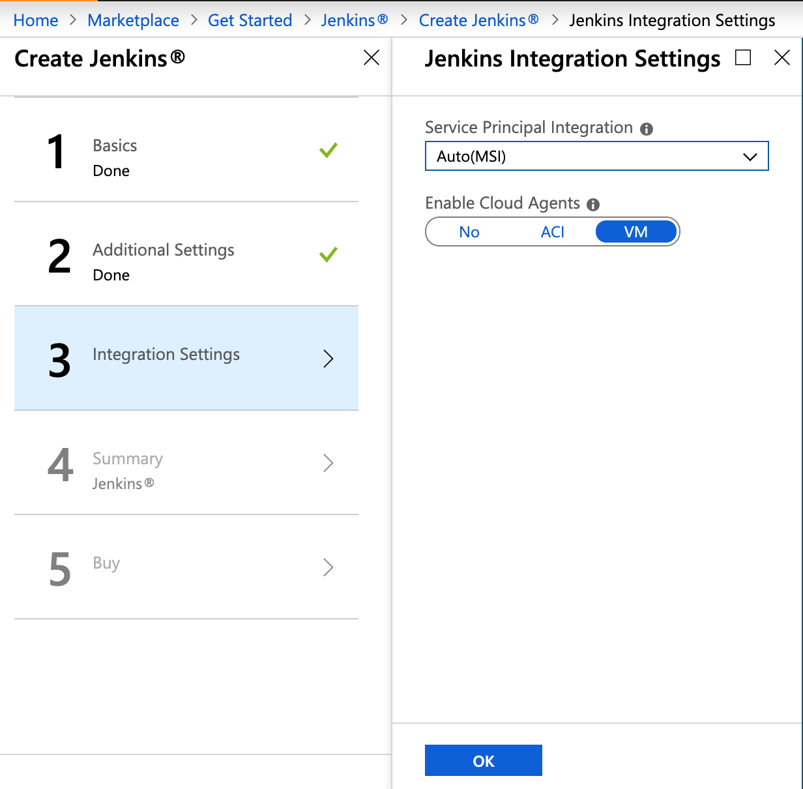
5. Make sure the details look correct, and press `OK`
   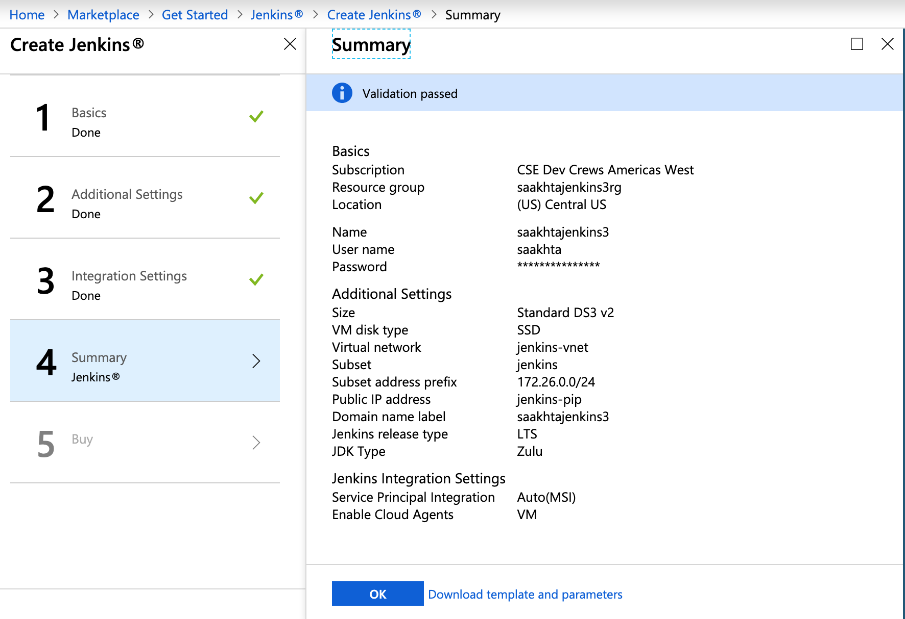
6. Accept the terms and conditions, and press `OK`
7. Allow some time for the deployments to complete, and there should be an `Outputs` item on the left side menu
   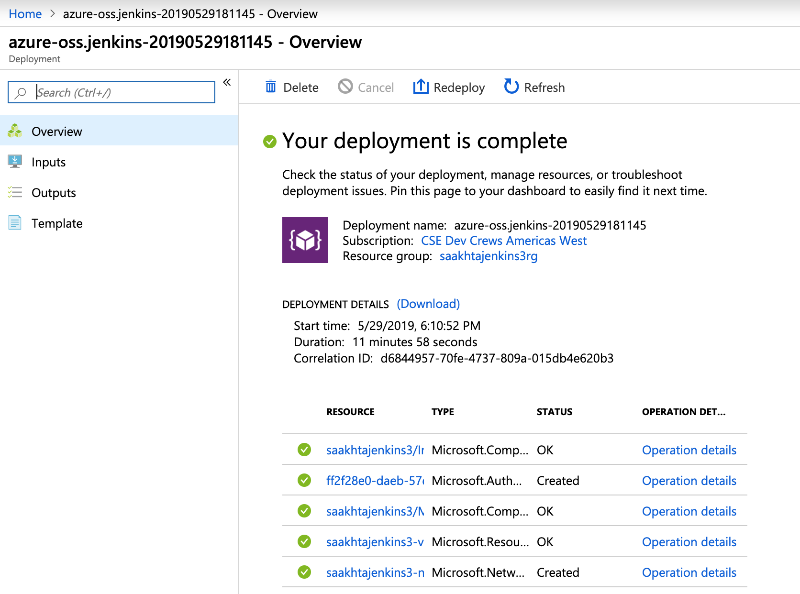
8. Click on `Outputs` to see the `jenkinsURL`, and copy it.
   
9. Access the Jenkins server and login. You may need to ssh into the virtual machine with port forwarding. 
   
10. It will ask you to Unlock Jenkins using a temporary password stored at the location given. `cd` into this location and paste the password, if you can't access the location, change to a root user using `sudo -s`.
    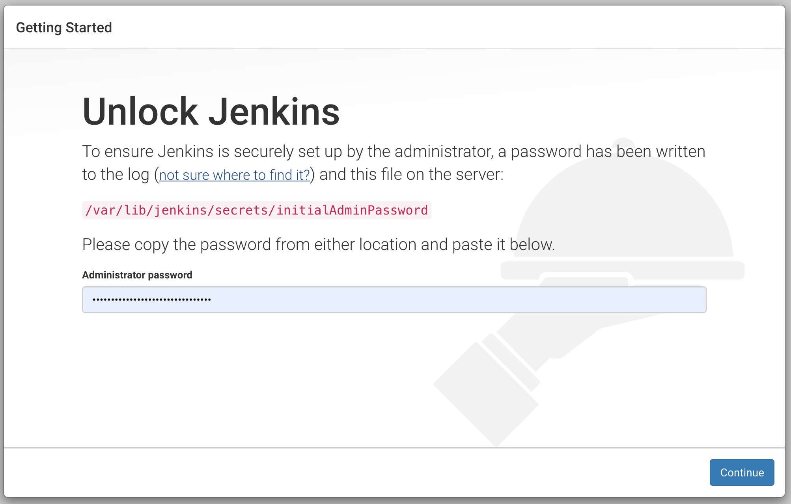
11. Create the first Admin User and hit `Save and Continue`.
12. Jenkins should be ready to use now!

## Configure Jenkins for Manifest Generation

1. The user `jenkins` in the VM needs to have access to execute `sudo` commands without requiring the password, head over to [this section](#Execute-sudo-commands-from-Jenkins-build).
2. In the Jenkins server webpage, click on `Create new jobs to get started` and enter an item name, select freestyle project. 
   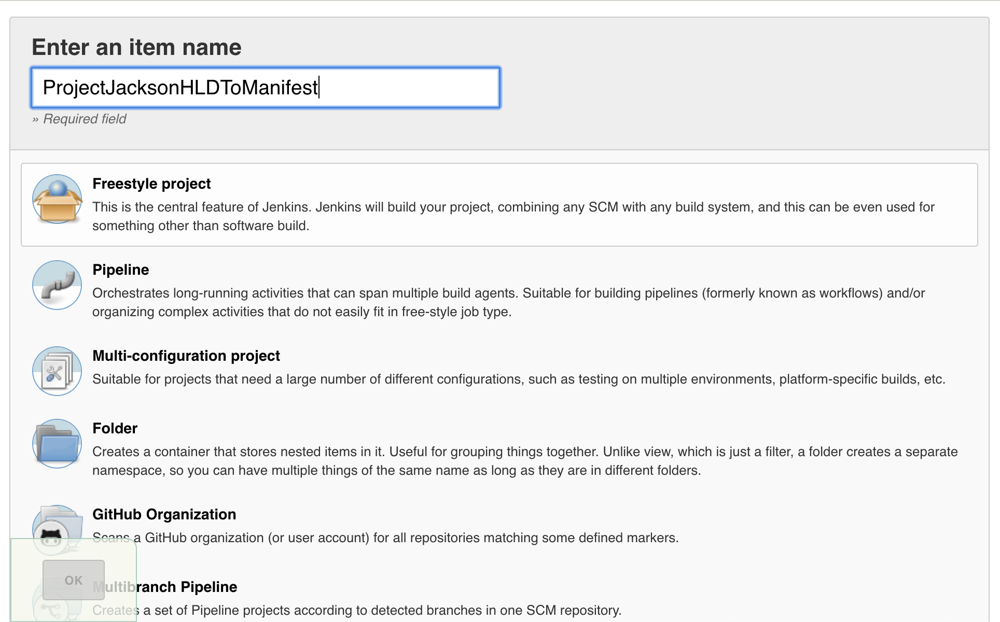
3. Under the `General` tab, there should be an option to check `This project is parameterized`. Click on `Add parameter` and add the following parameters: 
   
   - `REPO`: Set this to the manifest repo where Kubernetes manifest files should be pushed to, for example `https://github.com/samiyaakhtar/jackson-manifest`.
   - `COMMIT_MESSAGE`: Set this to an automated message for the commit, such as `Test from Jenkins`. 
   - `ACCESS_TOKEN_SECRET`: Set this to your personal access token for the git repository. Make this a Password Parameter. 
   - `HLD_REPO`: Set this to the high level definition repo, such as `https://github.com/samiyaakhtar/jackson-source`
  
   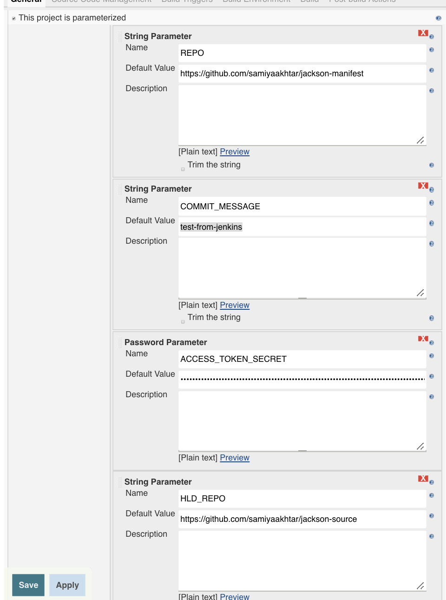

4. Under the `Source code management` tab, paste the URL to the git repository. If you would like to build all branches, leave the box empty for `Branch specifier`. 
   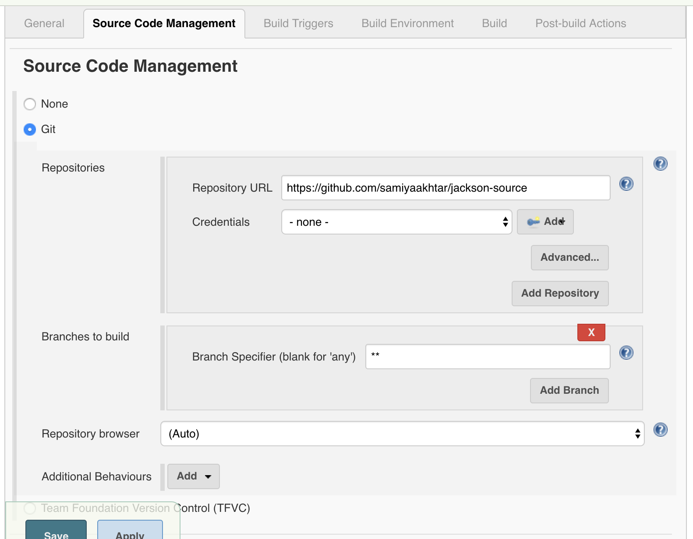
5. Under `Build Triggers`, select `GitHub hook trigger for GITScm polling`. 
   
6. Under `Build` click on `Add build step` -> `Execute shell` and paste the following code:
   ```
   #!/bin/bash

    sudo -s

    # Reset VM
    rm -rf *

    # Install Prerequisites
    sudo apt-get update
    sudo apt-get install -y curl git unzip libunwind-dev

    # Install and Initialize Helm
    curl -LO https://git.io/get_helm.sh
    chmod 700 get_helm.sh
    ./get_helm.sh
    helm init

    # Clone HLD Repo
    git clone $HLD_REPO
    hld_repo_url=$HLD_REPO
    hld_repo=${hld_repo_url##*/}

    # Extract repo name and copy content from it
    hld_repo_name=${hld_repo%.*}
    cp -r $hld_repo_name/* .

    # Download and execute build.sh
    curl https://raw.githubusercontent.com/Microsoft/bedrock/master/gitops/azure-devops/build.sh > build.sh
    chmod +x ./build.sh
    . build.sh
    ```
    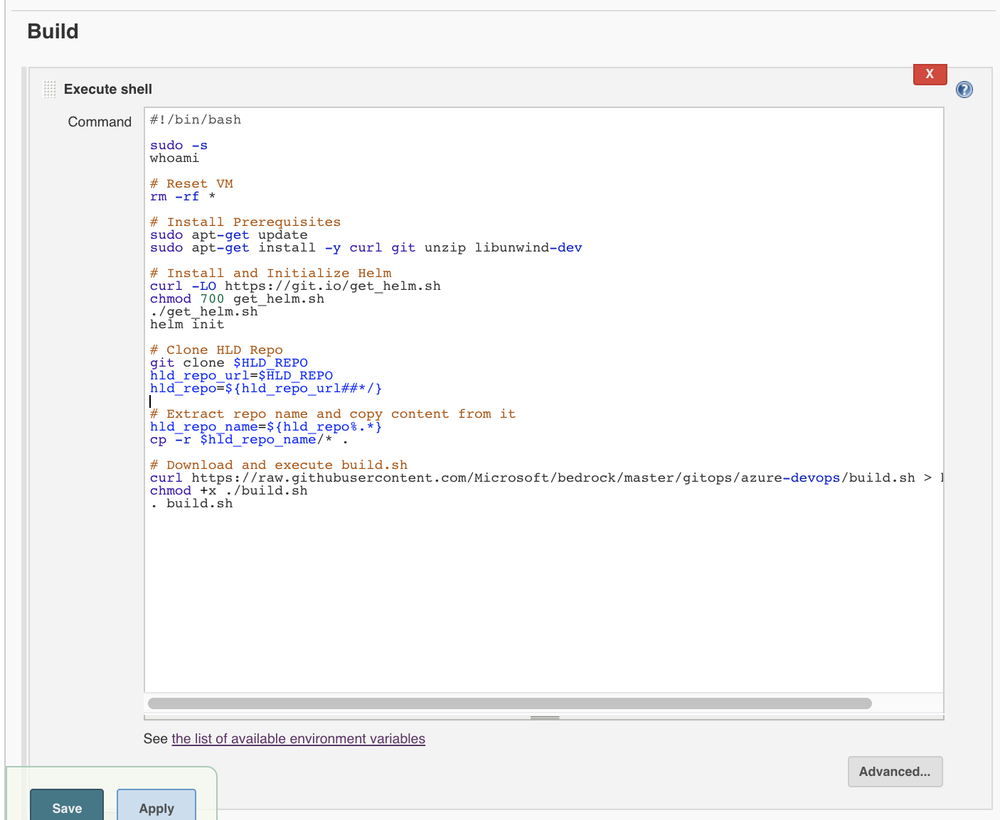

7. Click on `Build with Parameters` and hit `Build`:
   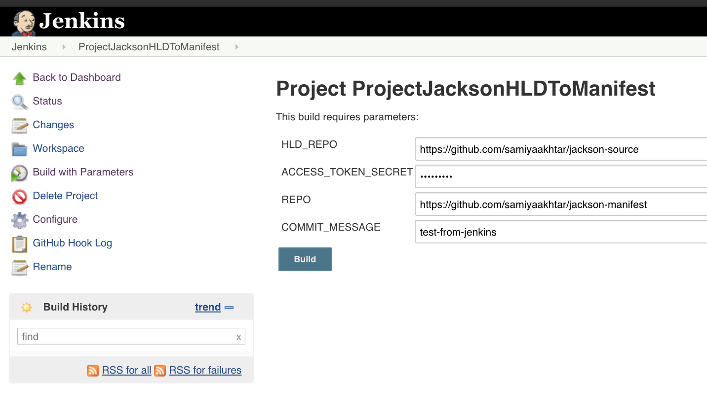
8. Click on the build that just started, and view `Console Output` from left navigation to view the logs for this build. 
   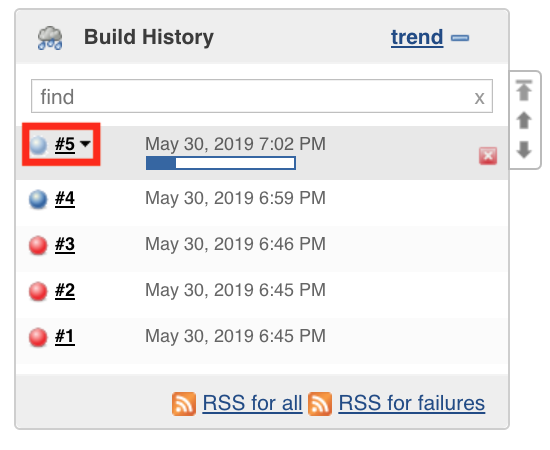
   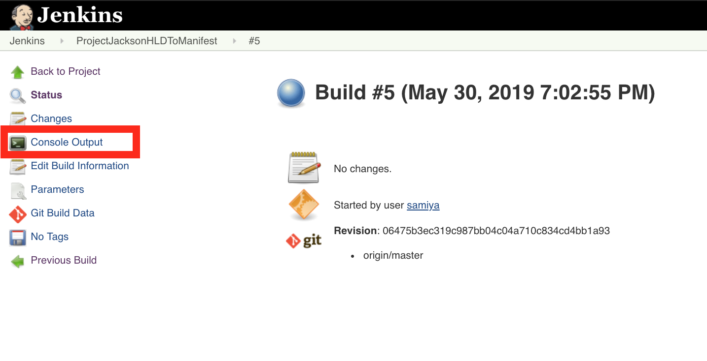
9. The build should clone the HLD repo, run the Fabrikate commands, and push the generated manifest files to your manifest repo. Head over to your manifest repository to see the changes that were pushed in!
   

At this stage the manifest generation pipeline is complete!

## Execute sudo commands from Jenkins build

This requires editing the sudoers file that allows the `jenkins` user to execute sudo commands without requiring a password. 
1. SSH into the virtual machine and type `sudo visudo`
2. Append `jenkins ALL=(ALL) NOPASSWD: ALL` at the end of the file. 
   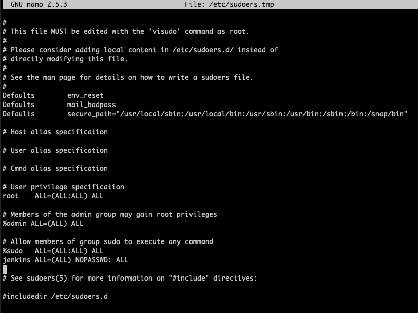
3. Write Out and save the file. 