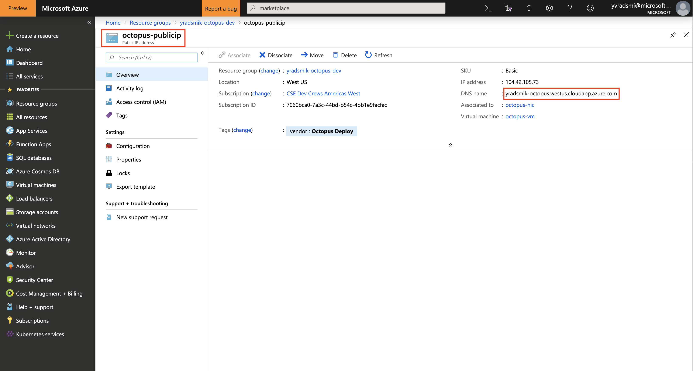
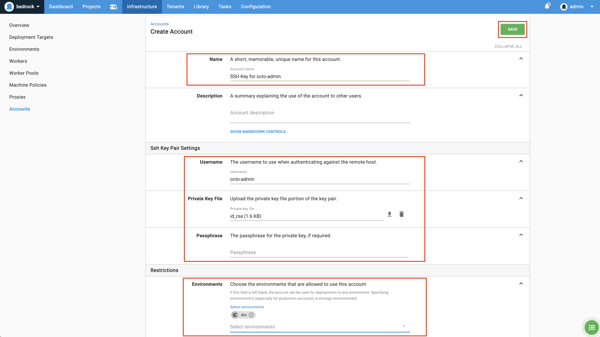
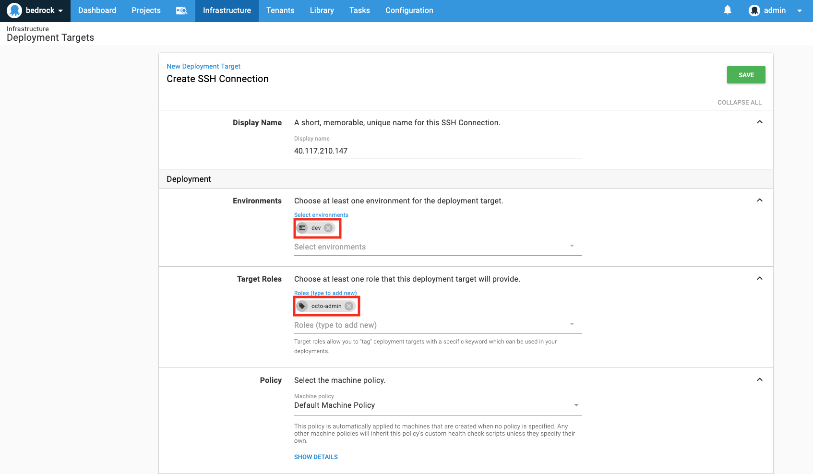
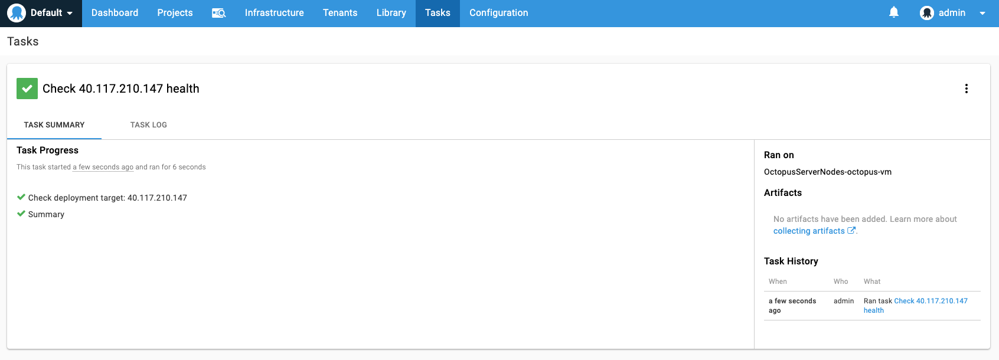
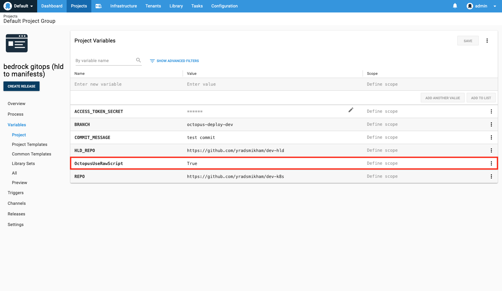
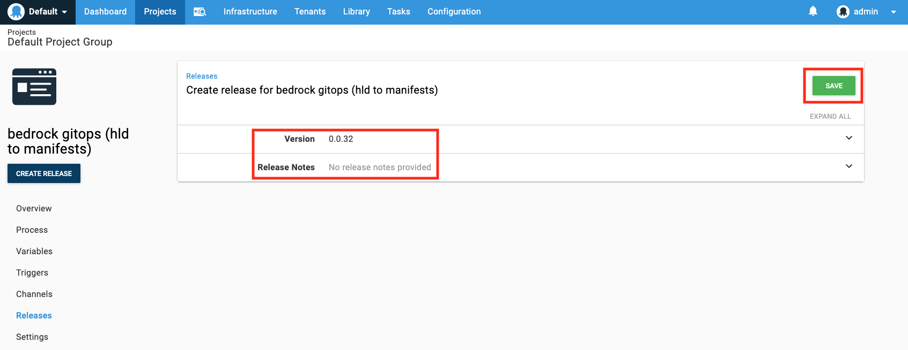
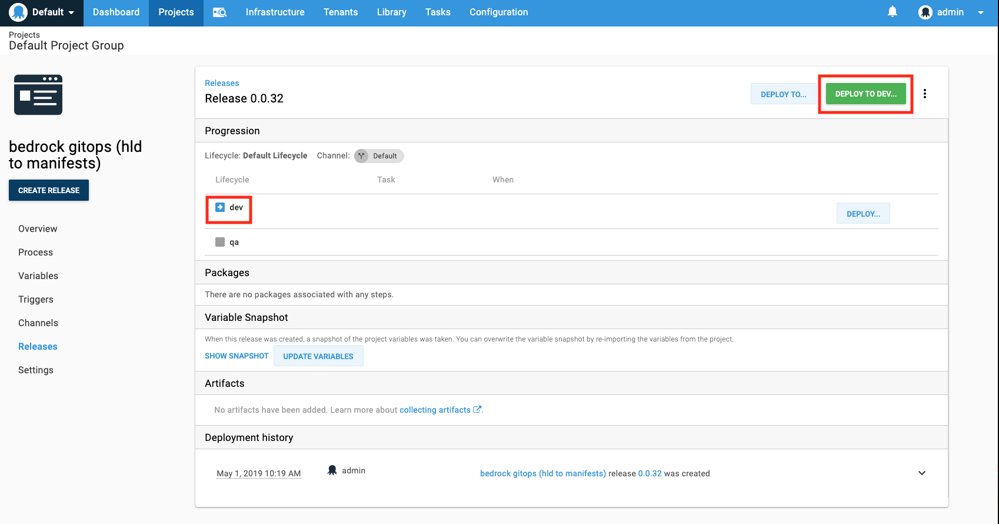
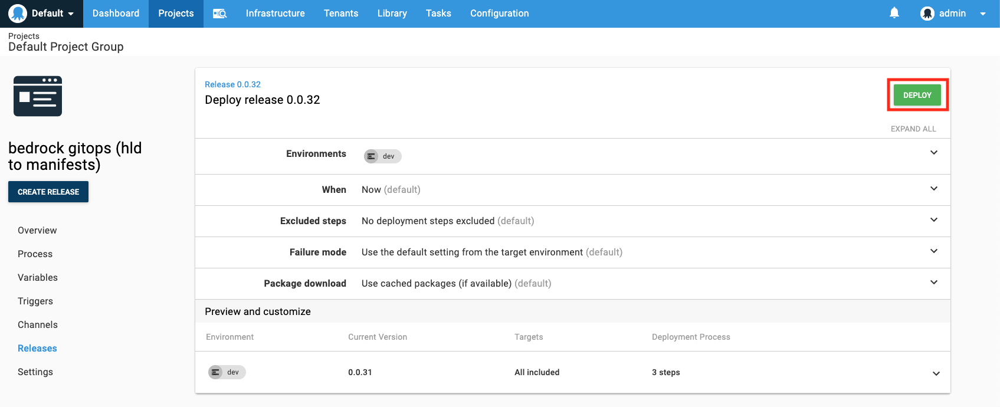
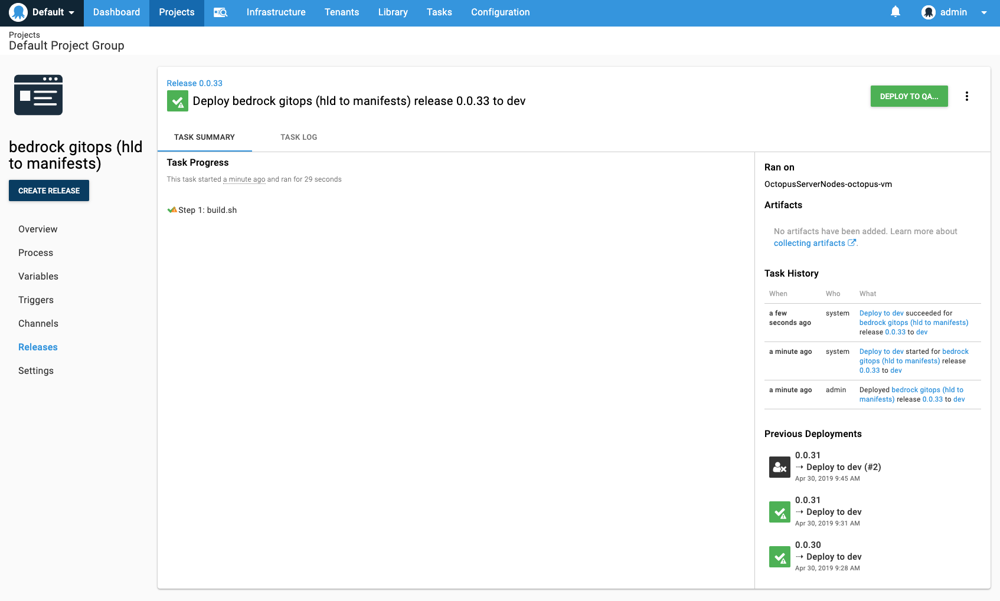

# Octopus Deploy

Octopus Deploy, an automated deployment and release management tool, has been tested against the [Bedrock GitOps](https://github.com/Microsoft/bedrock/blob/master/gitops/PipelineThinking.md) workflow. It is supported in the [Azure Marketplace](https://azuremarketplace.microsoft.com/en-us/marketplace/apps/octopus.octopusdeploy) with a free 45-day trial. This guide will assist in getting you started on installing, configuring, and deploying a Release on an Octopus Server (hosted in Azure) that is modeled after the following example of [manifest generation pipeline](../azure-devops/ManifestGeneration.md).


## Getting Started

### 1. Launch an Octopus Deploy Server in Azure Portal

1. Create an Octopus Deploy instance in Azure Portal


The following resources should populate in the resource group when Octopus Deploy is successfully deployed in Azure.


### 2. Login to your Octopus account

1. To access the Octopus Deploy server, you will need to find the DNS name of of the `octopus-publicip` resource.



You can access the Octopus Server via browser using the DNS name. Once there, login with the credentials that were used upon creation of the Octopus server (e.g. Octopus Deploy Administrator Credentials).

### 3. Create your Deployment Target resources

1. Create a Linux Virtual Machine in Azure. You can do this via the Azure CLI or in Azure Portal. If you do not already have an SSH key pair to use, you should generate one beforehand by running `ssh-keygen`. To create a VM using Azure CLI, run the following command:

```
az vm create \
  --resource-group "myResourceGroup" \
  --name "otco-vm" \
  --image "Debian" \
  --admin-username "octo-admin" \
  --ssh-key-value "path/to/ssh/keypair"
```

Change the arguments to something that is appropriate for your environment.

### 4. Create your Octopus Release

1. Create an environment(s) for your Release (e.g. `dev`, `qa`, `prod`).


2. Add Deployment Targets to your Infrastructure.


Specify the public IP address of the Linux VM.


If you have never added an account before, click on the option to add a new account and select "SSH Key Pair".


Enter the name of the username that was specified to create the VM (e.g. "octo-admin"). Then, upload the private key file that was generated when creating the SSH key. If there is a passphrase for the SSH Key, please include that as well. Finally, choose the appropriate environment for it to be used in and hit `Save`.



Navigate back to the Deployment Targets page. Select the environment that was created in Step 1, and create a new Target role (e.g. `octo-admin`). If a target role does not already exist, add a new role.



Be sure to select the name of the SSH key pair account that was created earlier. Hit `Save`.


3. Check the health of the Deployment Target(s)

Under Connectivity, there is the option to see the connection health of your VM.


Be sure that the connection health is in good standing before deploying your Release.



4. Define your deployment process.

Add a new step that will call a bash script. In this section, you will use the `build.sh` script from [Microsoft/Bedrock](https://github.com/Microsoft/bedrock/blob/master/gitops/azure-devops/build.sh). This `Inline Source Code` should do a few things: (1) ensure that the Deployment Target is "reset" for the Release deployment by removing all Fabrikate remnants and content from previous runs (2) install prerequisites like git, helm, etc. (3) define Environment Variables that are translatable in Octopus Deploy (4) Clone the HLD repo and extract content from it, and (5) download the `build.sh` and execute it.

```
#!/bin/bash

# Reset VM
rm -rf *

# Install Prerequisites
sudo apt-get update
sudo apt-get install -y curl git unzip libunwind-dev

# Install and Initialize Helm
curl -LO https://git.io/get_helm.sh
chmod 700 get_helm.sh
./get_helm.sh
helm init

# Define Environment Variables
ACCESS_TOKEN_SECRET=#{ACCESS_TOKEN_SECRET}
REPO=#{REPO}
HLD_REPO=#{HLD_REPO}
BRANCH=#{BRANCH}
COMMIT_MESSAGE=#{COMMIT_MESSAGE}

# Clone HLD Repo
git clone $HLD_REPO
hld_repo_url=$HLD_REPO
hld_repo=${hld_repo_url##*/}

# Extract repo name and copy content from it
hld_repo_name=${hld_repo%.*}
cp -r $hld_repo_name/* .

# Download and execute build.sh
curl https://raw.githubusercontent.com/Microsoft/bedrock/master/gitops/azure-devops/build.sh > build.sh
chmod +x ./build.sh
. build.sh
```

Under `Variables`, be sure to define the variables as shown:



It is important to enable [Raw Octopus](https://octopus.com/blog/trying-raw-octopus), or "Raw Scripting" for this pipeline because it is a default configuration to have deployments run [Calamari](https://octopus.com/docs/api-and-integration/calamari) when using Octopus Deploy, and this will interfere with "resetting" the Deployment Target. For this reason, raw scripting is used to allow the script steps to execute directly through the opened SSH connection without any extra wrapping or bootstrapping that comes naturally with Octopus. To do this, it is important to add the variable `OctopusUseRawScript` and set it to `True`.

### 5. Deploy

Create a Release for deployment!








### 6. Check Octopus Deploy Logs

After your Release is finished running, you can view the results and logs of the Release.




**NOTE**: The Fabrikate logs along with other logs from `build.sh` will show up as error logs in Octopus Deploy. This is miscontrued.

## Challenges with Octopus Deploy

- There is **less automation** when using Octopus Deploy in place of Azure DevOps.
    - Octopus Deploy requires that users provide their own resources, or Deployment Targets. Even though this could most likely be automated _outside_ of Octopus, this is still an additional step that is mandatory.
- There is no support for GitHub triggers.
    - This is the reason why cloning your HLD repo in advance was required as part of preparing your Deployment Targets.
    - In Azure DevOps, the ability to link your build and release pipelines to git repositories allow them to have access to the the resources without needing to clone them.
    - This also becomes problematic when automating a build or release when there are new commits made to the source repo. The closest thing to triggered releases is configuring scheduled releases in Octopus.
- Octopus currently does not allow users to build custom plugins or extensions.
    - This makes it difficult for users or organizations who want to have a more custom CI/CD workflow.

## TeamCity

[TeamCity](https://www.jetbrains.com/teamcity/) from JetBrains is a popular CI tool, often used with Octopus Deploy, which behaves more as a CD tool. We have put together documentation on how to setup a pipeline around [Image Tag Release](https://github.com/samiyaakhtar/bedrock/blob/teamcity/gitops/teamcity/ImageTagRelease.md) in TeamCity, and this works in conjunction with the [Image Tag Release Pipeline](https://github.com/microsoft/bedrock/blob/master/gitops/octopus/ImageTagRelease.md) in Octopus Deploy and the manifest generation pipeline described above. Altogether, the entire GitOps CI/CD workflow, as explained in our [Pipeline Thinking](https://github.com/microsoft/bedrock/blob/master/gitops/PipelineThinking.md), can be assembled.
