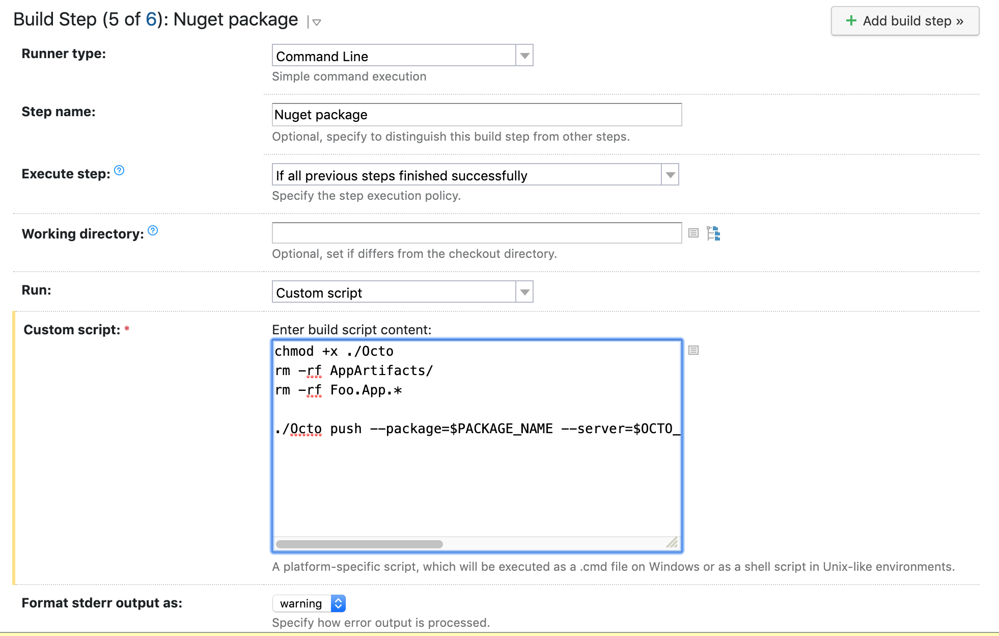
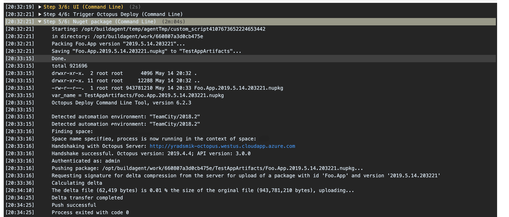
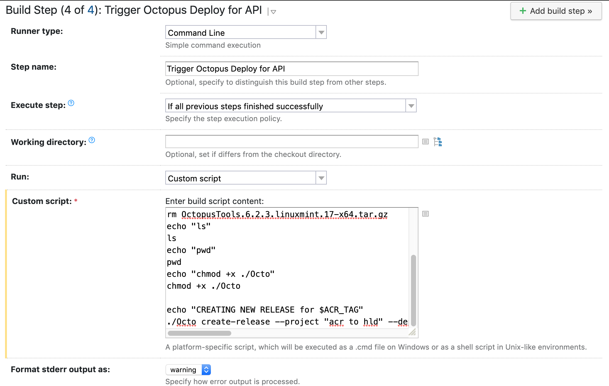
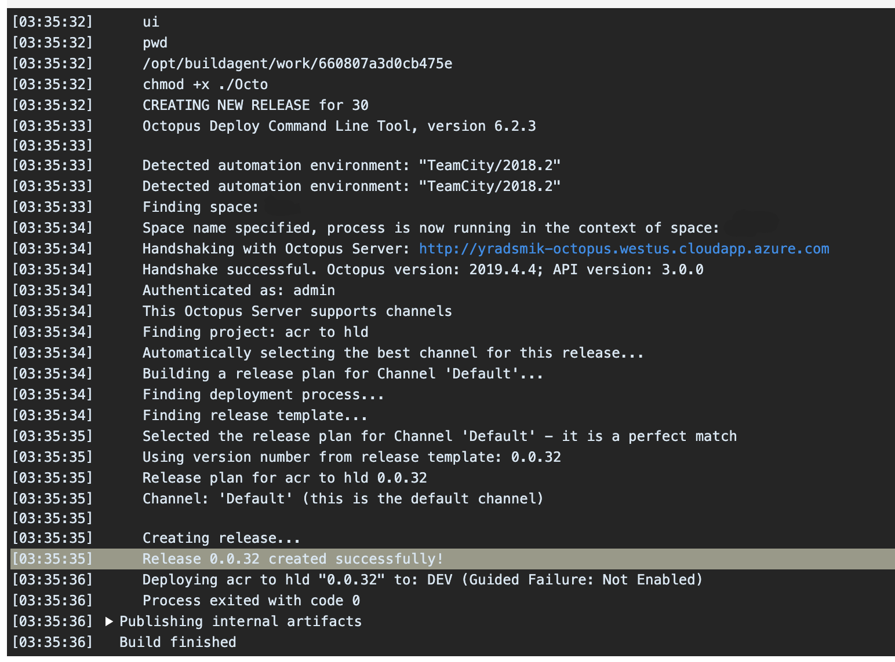

A common CD tool to use with TeamCity is Octopus Deploy. In this guide we're attempting to trigger a release pipeline in Octopus Deploy from an image tag release pipeline in TeamCity. 

## Pre-requisite

Make sure you already have a running CI pipeline in TeamCity and a CD pipeline in Octopus, or follow the guides available for [TeamCity](./README.md) and [Octopus](../octopus/README.md) to setup the individual pipelines. 

## Trigger Octopus from TeamCity

There are two ways to trigger Octopus from TeamCity. The more direct method is to invoke the `octo.exe` CLI and use their `create-release` script to kick off a new release, and the other method is to create a NuGet package for the application and push it to the Octopus package repository. This second method is more preferable in cases where a NuGet package can be built from the source code, and does not involve any direct project triggers in Octopus from TeamCity. The following guide provices both options for achieving this.

### Trigger Octopus using NuGet package

For projects that use NuGet packages to build and push their applications, the following trigger to Octopus is the more preferred method. First we build the source code application, package it up into a NuGet application and publish it into the Octopus package repository. The steps below assume that your application code is already generating a NuGet package and that it is available to push.

Add a build step to the end of the other build steps, which would push the NuGet package:



Paste the following code and replace `Foo.App` with your app name:
```
chmod +x ./Octo 
rm -rf AppArtifacts/
rm -rf Foo.App.*

./Octo push --package=$PACKAGE_NAME --server=$OCTO_SERVER --apiKey=$OCTO_API_KEY  --replace-existing  --space $OCTO_SPACE
```

This code assumes the following variables are defined as environment variables under Parameters: 

- `PACKAGE_NAME`: The name of your .nupkg file
- `OCTO_SERVER`: The URL to your Octopus server
- `OCTO_API_KEY`: Obtain an API key for your Octopus server by going into your profile settings. It should be in the format `API-XXXXXXXXXXXXXXXXXX`
- `OCTO_SPACE`: The project space in which the release resides under. If it's under default, you may skip this parameter.

Make sure this build step executes after all other build steps are complete. Do a test run to see the logs from this build, and they should look something like below:



Next, you've to setup Automatic Release Creation in Octopus, follow the guide [here](../octopus/ImageTagRelease.md#enable-automatic-release-creation-and-auto-deploy).

### Trigger Octopus by creating new explicit release

This guide sets a build step for triggering Octopus CD for an Image Tag Release pipeline that we set up for the GitOps workflow. It builds an ACR image and publishes it, then triggers Octopus Deploy with the tag of the newly built image. 

Add a build step to the end of the integration steps, which would trigger Octopus CD. It should look like below:



Add the following code to the custom script which downloads the Octo CLI, and triggers a release: 

```
# Download a pre-requisite to run octo.exe
echo "DOWNLOADING libunwind.so"
apt-get install -y libunwind-dev

# Download a stable version of octo.exe
echo "DOWNLOADING OCTO.EXE"
wget https://download.octopusdeploy.com/octopus-tools/6.2.3/OctopusTools.6.2.3.linuxmint.17-x64.tar.gz
tar xvzf OctopusTools.6.2.3.linuxmint.17-x64.tar.gz
rm OctopusTools.6.2.3.linuxmint.17-x64.tar.gz
echo "chmod +x ./Octo"
chmod +x ./Octo

echo "CREATING NEW RELEASE for $ACR_CONTAINER_TAG"
./Octo create-release --project $PROJECT_NAME --deployto $ENV_NAME --server $OCTO_SERVER --apiKey $OCTO_API_KEY --space $OCTO_SPACE --variable "YAML_PATH_VALUE:$ACR_CONTAINER_TAG"
```

This step assumes the following variables are set up in TeamCity:

- `OCTO_API_KEY`: Obtain an API key for your Octopus server by going into your profile settings. It should be in the format `API-XXXXXXXXXXXXXXXXXX`
- `OCTO_SERVER`: URL for the Octopus server
- `ACR_CONTAINER_TAG`: In order to set an ACR tag that contains build number, branch name and commit hash, follow steps [here](./ImageTagRelease.md#creating-an-acr-container-tag-with-branch-name-commit-hash-and-build-number). Otherwise, If you would like to skip creating a complex ACR tag for simplicity, set this to any constant image tag which is stable in your ACR. 
- `ENV_NAME`: This should be set to the environment you would like to create a release for. For example `DEV`.
- `PROJECT_NAME`: The name of the project you're creating a release for
- `OCTO_SPACE`: The project space in which the release resides under. If it's under default, you may skip this parameter. 

Make sure this build step executes after the ACR images are built in the pipeline. Do a test run to see the logs from ths build step, and they should look like something below:

